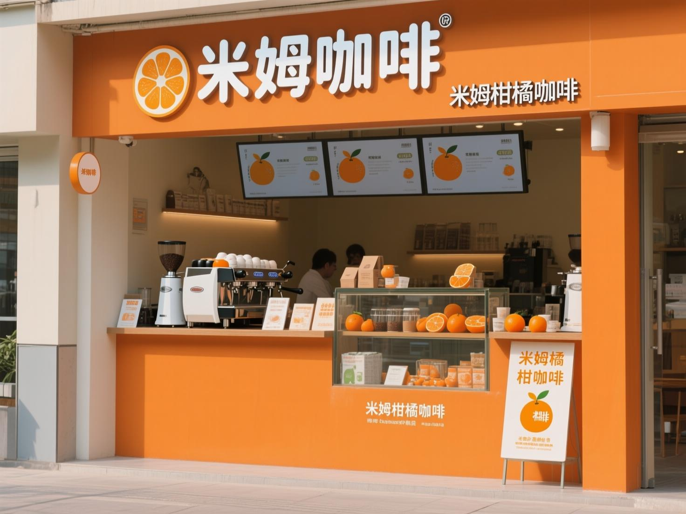

《至技术部门全员》

尊敬的CTO，技术部门全体成员：

你们好，如大家所知，我们公司米姆咖啡是一个连锁咖啡品牌，其主要业务是咖啡零售，包括线下门店和线上官方旗舰店，主要单品是“米姆柑橘拿铁”，线下销售新鲜咖啡，主要在上海和杭州，线上销售瓶装即饮型咖啡。

最近公司的处境不容乐观，一方面：市面上出现了新的咖啡产品“咖啡胶囊”是我们的潜在隐患，我们的商品经理忧心忡忡。另外，双十一的准备工作中，市场经理需要您团队提供物料制作的技术支持；采购经理刚刚报告了我们柑橘糖浆的主要供货商倒闭了，需要您团队帮助选品；仓储经理还报告了上海门店的库存问题...

总之，公司处在内外交困的关键时期。

您之前在董事会的提案“使用智能体(Agentic Organization) 重构公司"，得到了大部分董事会成员的支持，我们从魔搭社区和datawhale社区请来了技术支持。

请您按照您的计划实行，希望您和团队扶大厦之于将倾，拯救米姆咖啡于危难之中。

PS: 附件是各部门提交的需求清单

米拉

CEO, 米姆咖啡

-----

附件

场景1： [市场分析师] 新产品类型”咖啡胶囊“的市场调研：
- 需求明细：咖啡市场上最近出现了一种新形态的咖啡产品：咖啡胶囊。需要商品经理调研这个新兴产品形态的市场情况，包括但不限于：市场总量，主要公司，受众群体以及与其他咖啡产品的对比。要求产生完整的调研报告，数据详实，包含必要的引用。
- 涉及知识点：agentic rag模式，规划模式，DeepResearcher模式，多智能体模式，代码生成模式

场景2：[市场经理] ”双十一“宣传物料制作：
- 需求明细：米姆咖啡针对双十一推出促销活动，需要制作线上广告物料。需要包含商品主题（爆款”米姆柑橘拿铁“），结合双十一的大促（满300减50）。要求制作960\*480的海报图片，500\*500的商品主图。
- 涉及知识点：多智能体模式，工作流模式

场景3：[采购经理] “柑橘糖浆”选品采购：
- 需求明细：门店中的糖浆的供应商需要更换，需要从网上订购”柑橘“糖浆，要求根据价格选择较低，成交量较高的单品，完成下单。
- 涉及知识点：工具使用模式，工作流模式

场景4：[仓储物流经理] 上海仓库管理调配：
- 需求明细：上海的门店爆单，需要自动跟踪上海仓库的糖浆和咖啡豆的库存，从义乌主仓库调配，必要时从杭州门店调配。要求实现小时级别的响应。
- 涉及知识点：元认知模式，工具使用模式

场景5：[财务经理] 工资核算：
场景6：[运营专员] 电商运营：店铺运营